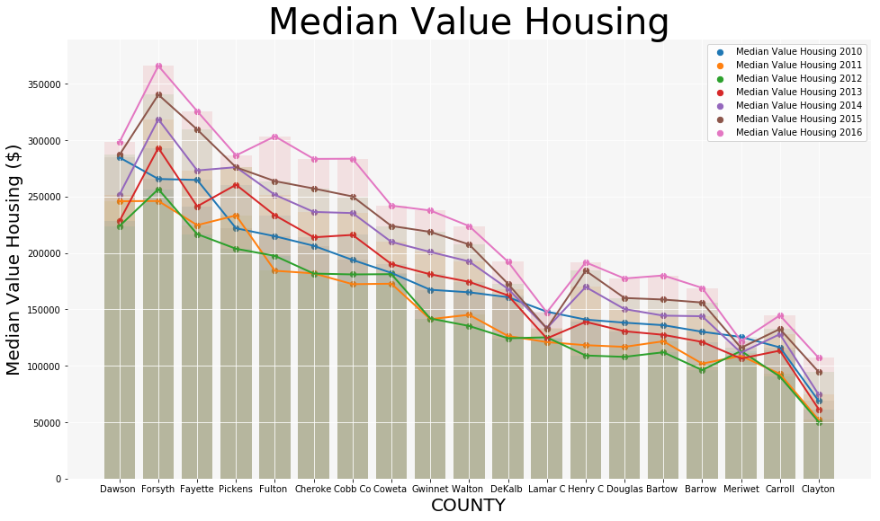
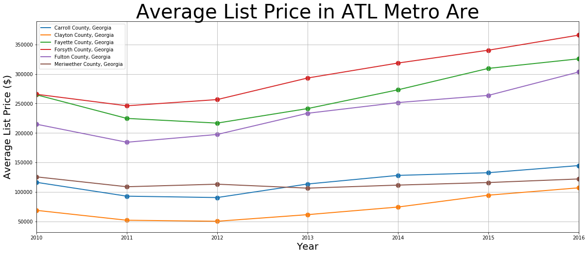
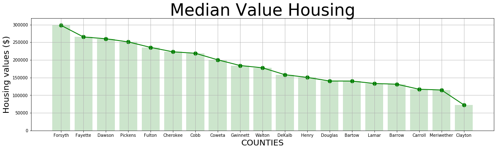
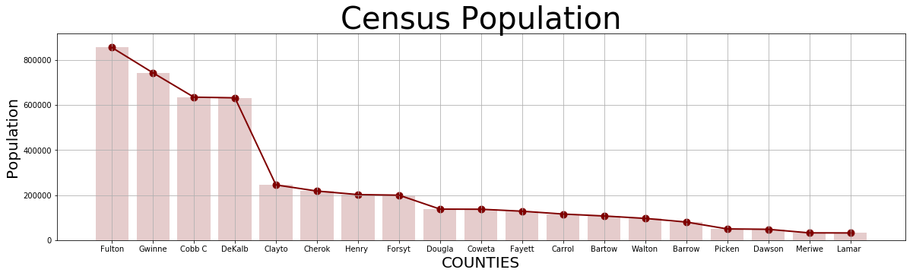
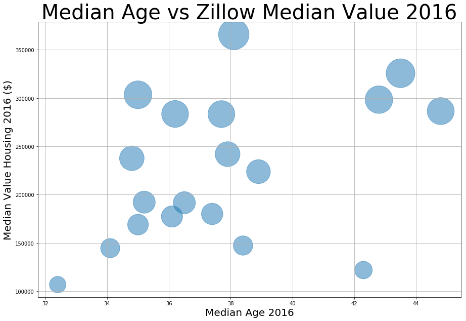
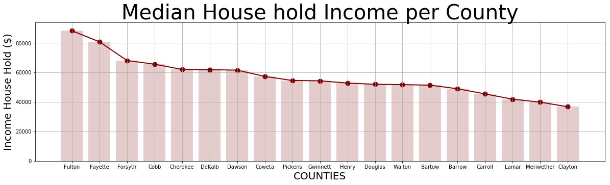
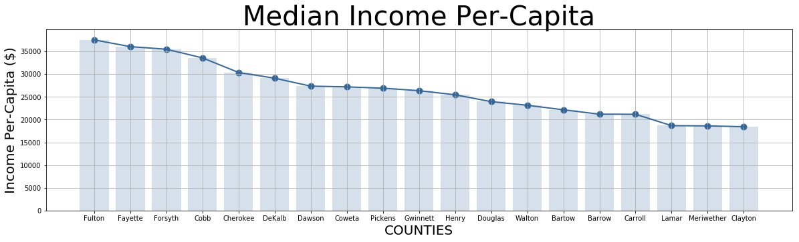
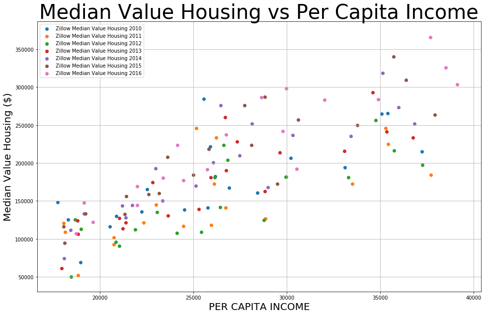

   ## Housing prices, data analysis and predictions
___

   ### Questions asked:
    1 How Atlanta’s median house price compare to other fast-growing metro areas in the US. 
    2 Does location in the Atlanta metro area (County) have a direct impact in house pricing? What is the reality within the metro area?
    3 How prices have change since 2010? 
    4 Is this trend related to population growth?
    5 How per capital income correlates to house prices?
    6 Is population increasing in the suburbs? How is this affecting house prices?


## Census API


#### Code and Description
____


* B01003_001E = Population 
* B01002_001E = Median Age 
* B19013_001E = Household Income
* B19301_001E = Per Capita Income
* B25077_001E = Median Value Housing Units
* B17001_002E = Poverty Count 
____


<br />
<br />

## FIPS (Federal Information Processing Standards)

#### State FIPS code
* 13 Georgia

#### County FIPS code
___

* 13121 - Fulton County
* 13135 - Gwinnett County
* 13089 - DeKalb County
* 13067 - Cobb County
* 13063 - Clayton County
* 13057 - Cherokee County
* 13151 - Henry County
* 13117 - Forsyth County
* 13097 - Douglas County
___


```python
## Dependencies
import numpy as np
import pandas as pd
import matplotlib.pyplot as plt
from functools import reduce
import requests
from census import Census
import gmaps
from scipy.stats import sem
from scipy.stats import linregress
from IPython.display import display, HTML, clear_output
from sklearn.externals import joblib
import time


# Census & gmaps API Keys
from security.census_key import (api_key, gkey)

# Internal functionality
from functions import print_message,calculate_percentage,get_column_des,get_merged_data,get_fields,get_filters,print_message,print_plot,print_bars, get_zillow_column_des, get_std_error, print_trendline

zillow_csv = './data/County_MedianListingPrice_AllHomes.csv'

# Years to be retrieved from census API
years = np.arange(2010, 2017, 1)
```

### Getting Census data from API


```python
# Run Census Search to retrieve data on all Atlanta metro counties
array_census_data = []

print_message("Starting retrieving data from Census API")

# Iterate throught the years array and call the Census API:
for year in years:
    census_API = Census(api_key, year = year)

    array_census_data.append(pd.DataFrame(census_API.acs5.get(get_fields(), get_filters())).rename(columns = get_column_des(year)))
    
    print(f"Processing data from census on year:{year}")


print_message("Retrieving data from Census API done")

```

    -----------------------------------------
    Starting retrieving data from Census API
    -----------------------------------------
    Processing data from census on year:2010
    Processing data from census on year:2011
    Processing data from census on year:2012
    Processing data from census on year:2013
    Processing data from census on year:2014
    Processing data from census on year:2015
    Processing data from census on year:2016
    -----------------------------------------
    Retrieving data from Census API done
    -----------------------------------------


### Clean and formatting  Census data


```python
# Merge all the datasets previously retrieved.
census_data = get_merged_data(array_census_data, ['Name', 'State', 'MunicipalCodeFIPS'])

# Delete columns that we no longer use.
census_data.drop(columns="State", inplace=True)

# Insert index to the new and merged DataFrame.
census_data.set_index(["MunicipalCodeFIPS", "Name"], inplace=True)

# Show dataframe.
census_data.head(2)

```


<div>
<style scoped>
    .dataframe tbody tr th:only-of-type {
        vertical-align: middle;
    }

    .dataframe tbody tr th {
        vertical-align: top;
    }

    .dataframe thead th {
        text-align: right;
    }
</style>
<table border="1" class="dataframe">
  <thead>
    <tr style="text-align: right;">
      <th></th>
      <th></th>
      <th>Median Age 2010</th>
      <th>Population 2010</th>
      <th>Poverty Count 2010</th>
      <th>Household Income 2010</th>
      <th>Per Capita Income 2010</th>
      <th>Median Value Housing Units 2010</th>
      <th>Median Age 2011</th>
      <th>Population 2011</th>
      <th>Poverty Count 2011</th>
      <th>Household Income 2011</th>
      <th>...</th>
      <th>Poverty Count 2015</th>
      <th>Household Income 2015</th>
      <th>Per Capita Income 2015</th>
      <th>Median Value Housing Units 2015</th>
      <th>Median Age 2016</th>
      <th>Population 2016</th>
      <th>Poverty Count 2016</th>
      <th>Household Income 2016</th>
      <th>Per Capita Income 2016</th>
      <th>Median Value Housing Units 2016</th>
    </tr>
    <tr>
      <th>MunicipalCodeFIPS</th>
      <th>Name</th>
      <th></th>
      <th></th>
      <th></th>
      <th></th>
      <th></th>
      <th></th>
      <th></th>
      <th></th>
      <th></th>
      <th></th>
      <th></th>
      <th></th>
      <th></th>
      <th></th>
      <th></th>
      <th></th>
      <th></th>
      <th></th>
      <th></th>
      <th></th>
      <th></th>
    </tr>
  </thead>
  <tbody>
    <tr>
      <th>013</th>
      <th>Barrow County, Georgia</th>
      <td>32.9</td>
      <td>66359.0</td>
      <td>8295.0</td>
      <td>48958.0</td>
      <td>20882.0</td>
      <td>138900.0</td>
      <td>33.1</td>
      <td>68061</td>
      <td>8912</td>
      <td>50604</td>
      <td>...</td>
      <td>10902.0</td>
      <td>52012.0</td>
      <td>21411.0</td>
      <td>119700.0</td>
      <td>35.0</td>
      <td>73340.0</td>
      <td>10548.0</td>
      <td>53133.0</td>
      <td>21978.0</td>
      <td>123200.0</td>
    </tr>
    <tr>
      <th>015</th>
      <th>Bartow County, Georgia</th>
      <td>36.1</td>
      <td>97423.0</td>
      <td>13472.0</td>
      <td>49216.0</td>
      <td>22241.0</td>
      <td>146800.0</td>
      <td>36.2</td>
      <td>98905</td>
      <td>15076</td>
      <td>49060</td>
      <td>...</td>
      <td>15819.0</td>
      <td>48893.0</td>
      <td>22592.0</td>
      <td>123800.0</td>
      <td>37.4</td>
      <td>101942.0</td>
      <td>14899.0</td>
      <td>50565.0</td>
      <td>23376.0</td>
      <td>128200.0</td>
    </tr>
  </tbody>
</table>
<p>2 rows × 42 columns</p>
</div>


### Zillow Data Munging from .CSV  


```python
# Get Zillow CSV historical data.
# Source: https://www.zillow.com/research/data/
zillow_data = pd.read_csv(zillow_csv)

# Defining FIPS for State and Counties.
georgia_fips = 13
county_fips = ['121','135','089','067','063','057','151','117','097','077','045','113','015','297','013','227','085','199','171']

# Filtering CSV by State and Countues.
metro_atlanta_data = zillow_data[(zillow_data["StateCodeFIPS"] == georgia_fips) & (zillow_data["MunicipalCodeFIPS"].isin(county_fips))]

# Delete columns no longer needed.
metro_atlanta_data = metro_atlanta_data.drop(columns=["State", "Metro", "StateCodeFIPS", "SizeRank", "RegionName"])

# Define new index for DataFrame.
metro_atlanta_data.set_index(["MunicipalCodeFIPS"], inplace=True)

# Transpose DataFrame in order to filter year-month with ease.
metro_atlanta_data = metro_atlanta_data.T

# Remove index.
metro_atlanta_data.reset_index(inplace=True)

# Replace text for year-month to year.
metro_atlanta_data["year"] = metro_atlanta_data["index"].apply(lambda x: x[:(len(x) - x.find("-")) + 1])

# Delete columns no longer needed.
metro_atlanta_data = metro_atlanta_data.drop(columns=["index"])

# Group data by year and get the average amount.
metro_atlanta_data = metro_atlanta_data.groupby("year").mean()

# Transpose again the DataFrame.
metro_atlanta_data = metro_atlanta_data.T

# Decorate the DataFrame with columns description.
metro_atlanta_data.rename(columns=get_zillow_column_des(), inplace=True)

# Show DataFrame.
metro_atlanta_data.head(2)

```


<div>
<style scoped>
    .dataframe tbody tr th:only-of-type {
        vertical-align: middle;
    }

    .dataframe tbody tr th {
        vertical-align: top;
    }

    .dataframe thead th {
        text-align: right;
    }
</style>
<table border="1" class="dataframe">
  <thead>
    <tr style="text-align: right;">
      <th>year</th>
      <th>Zillow Median Value Housing 2010</th>
      <th>Zillow Median Value Housing 2011</th>
      <th>Zillow Median Value Housing 2012</th>
      <th>Zillow Median Value Housing 2013</th>
      <th>Zillow Median Value Housing 2014</th>
      <th>Zillow Median Value Housing 2015</th>
      <th>Zillow Median Value Housing 2016</th>
      <th>Zillow Median Value Housing 2017</th>
      <th>Zillow Median Value Housing 2018</th>
    </tr>
    <tr>
      <th>MunicipalCodeFIPS</th>
      <th></th>
      <th></th>
      <th></th>
      <th></th>
      <th></th>
      <th></th>
      <th></th>
      <th></th>
      <th></th>
    </tr>
  </thead>
  <tbody>
    <tr>
      <th>121</th>
      <td>214815.000000</td>
      <td>184231.25</td>
      <td>197416.666667</td>
      <td>233341.666667</td>
      <td>251515.500000</td>
      <td>263650.416667</td>
      <td>303332.500000</td>
      <td>352743.125</td>
      <td>382600.0000</td>
    </tr>
    <tr>
      <th>135</th>
      <td>167389.041667</td>
      <td>141300.00</td>
      <td>141926.666667</td>
      <td>181081.666667</td>
      <td>200884.583333</td>
      <td>218675.083333</td>
      <td>237650.083333</td>
      <td>255407.375</td>
      <td>279210.3125</td>
    </tr>
  </tbody>
</table>
</div>


### Merging Census and Zillow DataFrames


```python
census_data_reset = census_data.reset_index()

census_data_reset["MunicipalCodeFIPS"] = census_data_reset["MunicipalCodeFIPS"].astype("l")

metro_atlanta_data_reset = metro_atlanta_data.reset_index()

zillow_census_data = pd.merge(census_data_reset, metro_atlanta_data_reset, how="outer", left_on="MunicipalCodeFIPS", right_on="MunicipalCodeFIPS")

zillow_census_data.set_index(["MunicipalCodeFIPS", "Name"], inplace=True)

zillow_census_data.to_csv("./data/zillow_census_data.csv")

zillow_census_data.head(2)

```


<div>
<style scoped>
    .dataframe tbody tr th:only-of-type {
        vertical-align: middle;
    }

    .dataframe tbody tr th {
        vertical-align: top;
    }

    .dataframe thead th {
        text-align: right;
    }
</style>
<table border="1" class="dataframe">
  <thead>
    <tr style="text-align: right;">
      <th></th>
      <th></th>
      <th>Median Age 2010</th>
      <th>Population 2010</th>
      <th>Poverty Count 2010</th>
      <th>Household Income 2010</th>
      <th>Per Capita Income 2010</th>
      <th>Median Value Housing Units 2010</th>
      <th>Median Age 2011</th>
      <th>Population 2011</th>
      <th>Poverty Count 2011</th>
      <th>Household Income 2011</th>
      <th>...</th>
      <th>Median Value Housing Units 2016</th>
      <th>Zillow Median Value Housing 2010</th>
      <th>Zillow Median Value Housing 2011</th>
      <th>Zillow Median Value Housing 2012</th>
      <th>Zillow Median Value Housing 2013</th>
      <th>Zillow Median Value Housing 2014</th>
      <th>Zillow Median Value Housing 2015</th>
      <th>Zillow Median Value Housing 2016</th>
      <th>Zillow Median Value Housing 2017</th>
      <th>Zillow Median Value Housing 2018</th>
    </tr>
    <tr>
      <th>MunicipalCodeFIPS</th>
      <th>Name</th>
      <th></th>
      <th></th>
      <th></th>
      <th></th>
      <th></th>
      <th></th>
      <th></th>
      <th></th>
      <th></th>
      <th></th>
      <th></th>
      <th></th>
      <th></th>
      <th></th>
      <th></th>
      <th></th>
      <th></th>
      <th></th>
      <th></th>
      <th></th>
      <th></th>
    </tr>
  </thead>
  <tbody>
    <tr>
      <th>13</th>
      <th>Barrow County, Georgia</th>
      <td>32.9</td>
      <td>66359.0</td>
      <td>8295.0</td>
      <td>48958.0</td>
      <td>20882.0</td>
      <td>138900.0</td>
      <td>33.1</td>
      <td>68061</td>
      <td>8912</td>
      <td>50604</td>
      <td>...</td>
      <td>123200.0</td>
      <td>130150.000</td>
      <td>101891.666667</td>
      <td>96191.666667</td>
      <td>121120.833333</td>
      <td>143908.875</td>
      <td>156055.25</td>
      <td>169008.333333</td>
      <td>184349.583333</td>
      <td>201605.625</td>
    </tr>
    <tr>
      <th>15</th>
      <th>Bartow County, Georgia</th>
      <td>36.1</td>
      <td>97423.0</td>
      <td>13472.0</td>
      <td>49216.0</td>
      <td>22241.0</td>
      <td>146800.0</td>
      <td>36.2</td>
      <td>98905</td>
      <td>15076</td>
      <td>49060</td>
      <td>...</td>
      <td>128200.0</td>
      <td>135982.375</td>
      <td>121733.958333</td>
      <td>111964.583333</td>
      <td>127450.000000</td>
      <td>144440.000</td>
      <td>158712.50</td>
      <td>180064.666667</td>
      <td>196071.875000</td>
      <td>205881.250</td>
    </tr>
  </tbody>
</table>
<p>2 rows × 51 columns</p>
</div>


### Looking for Correlations


```python
correlation = zillow_census_data[["Median Age 2016",
"Population 2016",
"Poverty Count 2016",
"Household Income 2016",
"Per Capita Income 2016",
"Zillow Median Value Housing 2016"]].corr()
correlation["Zillow Median Value Housing 2016"].sort_values(ascending=False)
```


    Zillow Median Value Housing 2016    1.000000
    Per Capita Income 2016              0.914057
    Household Income 2016               0.867888
    Median Age 2016                     0.408847
    Population 2016                     0.235961
    Poverty Count 2016                  0.090142
    Name: Zillow Median Value Housing 2016, dtype: float64


### Ploting Median Value Housing


```python
housing_data_by_year = zillow_census_data[["Zillow Median Value Housing 2010",
"Zillow Median Value Housing 2011",
"Zillow Median Value Housing 2012",
"Zillow Median Value Housing 2013",
"Zillow Median Value Housing 2014",
"Zillow Median Value Housing 2015",
"Zillow Median Value Housing 2016"]].reset_index()

housing_data_by_year.drop(columns="MunicipalCodeFIPS", inplace=True)

housing_data_by_year.set_index("Name", inplace=True)

housing_data_by_year.sort_values(by=['Zillow Median Value Housing 2010',
                                    'Zillow Median Value Housing 2011',
                                    'Zillow Median Value Housing 2012',
                                    'Zillow Median Value Housing 2013',
                                    'Zillow Median Value Housing 2014',
                                    'Zillow Median Value Housing 2015',
                                    'Zillow Median Value Housing 2016',], ascending=False, inplace=True)

housing_data_by_year_x = [(x[:(len(x) - x.find(" County,")) - 9]) for x in housing_data_by_year.index.values]

fig, ax = plt.subplots()
ax.plot(housing_data_by_year_x, housing_data_by_year, linewidth = 2)
ax.scatter(housing_data_by_year_x, housing_data_by_year["Zillow Median Value Housing 2010"], s = 40, label="Median Value Housing 2010")
ax.scatter(housing_data_by_year_x, housing_data_by_year["Zillow Median Value Housing 2011"], s = 40, label="Median Value Housing 2011")
ax.scatter(housing_data_by_year_x, housing_data_by_year["Zillow Median Value Housing 2012"], s = 40, label="Median Value Housing 2012")
ax.scatter(housing_data_by_year_x, housing_data_by_year["Zillow Median Value Housing 2013"], s = 40, label="Median Value Housing 2013")
ax.scatter(housing_data_by_year_x, housing_data_by_year["Zillow Median Value Housing 2014"], s = 40, label="Median Value Housing 2014")
ax.scatter(housing_data_by_year_x, housing_data_by_year["Zillow Median Value Housing 2015"], s = 40, label="Median Value Housing 2015")
ax.scatter(housing_data_by_year_x, housing_data_by_year["Zillow Median Value Housing 2016"], s = 40, label="Median Value Housing 2016")

ax.bar(housing_data_by_year_x, housing_data_by_year["Zillow Median Value Housing 2010"], alpha=0.1, label=None)
ax.bar(housing_data_by_year_x, housing_data_by_year["Zillow Median Value Housing 2011"], alpha=0.1, label=None)
ax.bar(housing_data_by_year_x, housing_data_by_year["Zillow Median Value Housing 2012"], alpha=0.1, label=None)
ax.bar(housing_data_by_year_x, housing_data_by_year["Zillow Median Value Housing 2013"], alpha=0.1, label=None)
ax.bar(housing_data_by_year_x, housing_data_by_year["Zillow Median Value Housing 2014"], alpha=0.1, label=None)
ax.bar(housing_data_by_year_x, housing_data_by_year["Zillow Median Value Housing 2015"], alpha=0.1, label=None)
ax.bar(housing_data_by_year_x, housing_data_by_year["Zillow Median Value Housing 2016"], alpha=0.1, label=None)

ax.grid()
ax.legend(loc="best")

ax.set_title("Median Value Housing", fontdict={"fontsize": "40"})
ax.set_xlabel("COUNTY", fontdict={"fontsize": "20"})
ax.set_ylabel("Median Value Housing ($)", fontdict={"fontsize": "20"})

ax.set_facecolor('#f6f6f6')
ax.grid(color="w")
ax.spines["top"].set_visible(False)
ax.spines["bottom"].set_visible(False)
ax.spines["left"].set_visible(False)
ax.spines["right"].set_visible(False)

fig.set_size_inches(16, 9)

fig.savefig('./images/housing_data_by_year.png')

```





### Plotting Three Highest and Lowest by location in the metro area


```python
# Three Highest on price:
# 117	Forsyth County, Georgia
# 113	Fayette County, Georgia
# 121	Fulton County, Georgia

# Three Lowest on price
# 63	Clayton County, Georgia
# 199	Meriwether County, Georgia
# 45	Carroll County, Georgia

zillow_census_data_ = zillow_census_data.reset_index()
zillow_census_data_ = zillow_census_data_[zillow_census_data_["MunicipalCodeFIPS"].isin([117,113,121,63,199,45])]

zillow_census_data_.set_index("Name", inplace=True)
zillow_census_data_.drop(columns="MunicipalCodeFIPS", inplace=True)

fig, ax = plt.subplots()

value_housing = zillow_census_data_[['Zillow Median Value Housing 2010',
             'Zillow Median Value Housing 2011',
             'Zillow Median Value Housing 2012',
             'Zillow Median Value Housing 2013',
             'Zillow Median Value Housing 2014',
             'Zillow Median Value Housing 2015',
             'Zillow Median Value Housing 2016'
            ]].astype('float').astype('l').T

ax.plot(years, value_housing['Carroll County, Georgia'], linewidth = 2,)
ax.scatter(years, value_housing['Carroll County, Georgia'], label=None, s = 80)
ax.plot(years, value_housing['Clayton County, Georgia'], linewidth = 2,)
ax.scatter(years, value_housing['Clayton County, Georgia'], label=None, s = 80)
ax.plot(years, value_housing['Fayette County, Georgia'], linewidth = 2,)
ax.scatter(years, value_housing['Fayette County, Georgia'], label=None, s = 80)

ax.plot(years, value_housing['Forsyth County, Georgia'], linewidth = 2,)
ax.scatter(years, value_housing['Forsyth County, Georgia'], label=None, s = 80)
ax.plot(years, value_housing['Fulton County, Georgia'], linewidth = 2,)
ax.scatter(years, value_housing['Fulton County, Georgia'], label=None, s = 80)
ax.plot(years, value_housing['Meriwether County, Georgia'], linewidth = 2,)
ax.scatter(years, value_housing['Meriwether County, Georgia'], label=None, s = 80)

ax.set_title("Average List Price in ATL Metro Are", fontdict= {'fontsize': "40"})
ax.set_xlabel("Year", fontdict={'fontsize': "20"})
ax.set_ylabel("Average List Price ($)", fontdict={'fontsize': "20"})

ax.set_xlim(left=2010, right=2016)

plt.legend()
ax.grid()

fig.set_size_inches(20, 8)

```





### Plotting grouped mean of (Median Value Housing) from 2010 to 2016


```python
display(HTML(f'<marquee>All these results are based on the calculated MEDIAN from 2010 to 2016 from Value Housing</marquee>'))

fig = plt.figure()

ax = fig.subplots()

zillow_value_housing = zillow_census_data[['Zillow Median Value Housing 2010',
             'Zillow Median Value Housing 2011',
             'Zillow Median Value Housing 2012',
             'Zillow Median Value Housing 2013',
             'Zillow Median Value Housing 2014',
             'Zillow Median Value Housing 2015',
             'Zillow Median Value Housing 2016'
            ]].astype('float').T.mean()

zillow_value_housing = zillow_value_housing.reset_index()

zillow_value_housing = zillow_value_housing.drop(columns=["MunicipalCodeFIPS"])

zillow_value_housing = zillow_value_housing.set_index("Name")

zillow_value_housing = zillow_value_housing[0].sort_values(ascending=False)

zillow_value_housing_x = [(x[:(len(x) - (len(x) - x.find(" County,")))]) for x in zillow_value_housing.index.values]

ax.plot(zillow_value_housing_x, zillow_value_housing, linewidth = 2, color="g")
ax.scatter(zillow_value_housing_x, zillow_value_housing, label=None, s = 80, color="g")
ax.bar(zillow_value_housing_x, zillow_value_housing, color="g", alpha=0.2)

ax.set_title("Median Value Housing", fontdict= {'fontsize': "40"})
ax.set_xlabel("COUNTIES", fontdict={'fontsize': "20"})
ax.set_ylabel("Housing values ($)", fontdict={'fontsize': "20"})

ax.grid()

fig.set_size_inches(20, 5)

fig.savefig('./images/zillow_value_housing.png')

```


<marquee>All these results are based on the calculated MEDIAN from 2010 to 2016 from Value Housing</marquee>





### Population by County 


```python
display(HTML(f'<marquee>All these results are based on Census data from 2010 to 2016 for Population by Counties</marquee>'))

fig, ax = plt.subplots()

census_value_housing = zillow_census_data[['Median Value Housing Units 2010',
             'Population 2011',
             'Population 2012',
             'Population 2013',
             'Population 2014',
             'Population 2015',
             'Population 2016'
            ]].astype('float').T.mean()

census_value_housing = census_value_housing.reset_index()

census_value_housing = census_value_housing.drop(columns=["MunicipalCodeFIPS"])

census_value_housing = census_value_housing.set_index("Name")

census_value_housing = census_value_housing[0].sort_values(ascending=False)

census_value_housing_x = [(x[:(len(x) - x.find(" County,")) - 10]) for x in census_value_housing.index.values]

ax.plot(census_value_housing_x, census_value_housing, linewidth = 2, color="#800000")
ax.scatter(census_value_housing_x, census_value_housing, label=None, s = 80, color="#800000")
ax.bar(census_value_housing_x, census_value_housing, color="#800000", alpha=0.2)

ax.set_title("Census Population", fontdict= {'fontsize': "40"})
ax.set_xlabel("COUNTIES", fontdict= {'fontsize': "20"})
ax.set_ylabel("Population", fontdict= {'fontsize': "20"})

ax.grid()
fig.set_size_inches(20, 5)

```


<marquee>All these results are based on Census data from 2010 to 2016 for Population by Counties</marquee>





### Plotting Median Age correlation with Median Value Housing (2016)


```python
y = zillow_census_data["Zillow Median Value Housing 2016"]
x = zillow_census_data["Median Age 2016"]

plt.figure(figsize=(15,10))
plt.scatter(x, y, alpha=0.5, s=y/100)
plt.grid()

plt.title("Median Age vs Zillow Median Value 2016", fontdict= {'fontsize': "40"})
plt.xlabel("Median Age 2016", fontdict= {'fontsize': "20"})
plt.ylabel("Median Value Housing 2016 ($)", fontdict= {'fontsize': "20"}) 

plt.show()
```





### Plotting Grouped Mean of (Household Income) from 2010 to 2016


```python
display(HTML(f'<marquee>All these results are based on the calculated MEDIAN from 2010 to 2016</marquee>'))

fig, ax = plt.subplots()

median_income_house_hold = census_data[['Household Income 2010',
             'Household Income 2011',
             'Household Income 2012',
             'Household Income 2013',
             'Household Income 2014',
             'Household Income 2015',
             'Household Income 2016'
            ]].astype('float').T.mean()

median_income_house_hold = median_income_house_hold.reset_index()

median_income_house_hold = median_income_house_hold.drop(columns=["MunicipalCodeFIPS"])

median_income_house_hold = median_income_house_hold.set_index("Name")

median_income_house_hold = median_income_house_hold[0].sort_values(ascending=False)

median_income_house_hold_x = [(x[:(len(x) - (len(x) - x.find(" County,")))]) for x in median_income_capita.index.values]

ax.plot(median_income_house_hold_x, median_income_house_hold, linewidth = 2, color="#800000")
ax.scatter(median_income_house_hold_x, median_income_house_hold, label=None, s = 80, color="#800000")
ax.bar(median_income_house_hold_x, median_income_house_hold, color="#800000", alpha=0.2)

ax.set_title("Median House hold Income per County", fontdict= {'fontsize': "40"})
ax.set_xlabel("COUNTIES", fontdict={'fontsize': "20"})
ax.set_ylabel("Income House Hold ($)", fontdict={'fontsize': "20"})

ax.grid()

fig.set_size_inches(20, 5)

fig.savefig('./images/median_income_house_hold.png')

```


<marquee>All these results are based on the calculated MEDIAN from 2010 to 2016</marquee>





### Plotting Grouped Mean of (Median Income Per Capita) from 2010 to 2016


```python
display(HTML(f'<marquee>All these results are based on the calculated MEDIAN from 2010 to 2016 from INCOME PER CAPITA</marquee>'))

fig, ax = plt.subplots()

median_income_capita = zillow_census_data[['Per Capita Income 2010',
             'Per Capita Income 2011',
             'Per Capita Income 2012',
             'Per Capita Income 2013',
             'Per Capita Income 2014',
             'Per Capita Income 2015',
             'Per Capita Income 2016'
            ]].astype('float').T.mean()

median_income_capita = median_income_capita.reset_index()

median_income_capita = median_income_capita.drop(columns=["MunicipalCodeFIPS"])

median_income_capita = median_income_capita.set_index("Name")

median_income_capita = median_income_capita[0].sort_values(ascending=False)

median_income_capita_x = [(x[:(len(x) - (len(x) - x.find(" County,")))]) for x in median_income_capita.index.values]

ax.plot(median_income_capita_x, median_income_capita, linewidth = 2, color="#336699")
ax.scatter(median_income_capita_x, median_income_capita, label=None, s = 80, color="#336699")
ax.bar(median_income_capita_x, median_income_capita, color="#336699", alpha=0.2)

ax.set_title("Median Income Per-Capita", fontdict= {'fontsize': "40"})
ax.set_xlabel("COUNTIES", fontdict={'fontsize': "20"})
ax.set_ylabel("Income Per-Capita ($)", fontdict={'fontsize': "20"})

ax.grid()

fig.set_size_inches(20, 5)

fig.savefig('./images/median_income_capita.png')

```


<marquee>All these results are based on the calculated MEDIAN from 2010 to 2016 from INCOME PER CAPITA</marquee>





### Plotting Median Value Housing vs Per Capita Income


```python
income_capita = zillow_census_data[['Per Capita Income 2010',
             'Per Capita Income 2011',
             'Per Capita Income 2012',
             'Per Capita Income 2013',
             'Per Capita Income 2014',
             'Per Capita Income 2015',
             'Per Capita Income 2016'
            ]].astype('float')

fig, ax = plt.subplots()

ax.scatter(income_capita["Per Capita Income 2010"], zillow_census_data["Zillow Median Value Housing 2010"])
ax.scatter(income_capita["Per Capita Income 2011"], zillow_census_data["Zillow Median Value Housing 2011"])
ax.scatter(income_capita["Per Capita Income 2012"], zillow_census_data["Zillow Median Value Housing 2012"])
ax.scatter(income_capita["Per Capita Income 2013"], zillow_census_data["Zillow Median Value Housing 2013"])
ax.scatter(income_capita["Per Capita Income 2014"], zillow_census_data["Zillow Median Value Housing 2014"])
ax.scatter(income_capita["Per Capita Income 2015"], zillow_census_data["Zillow Median Value Housing 2015"])
ax.scatter(income_capita["Per Capita Income 2016"], zillow_census_data["Zillow Median Value Housing 2016"])

ax.set_title("Median Value Housing vs Per Capita Income", fontdict={'fontsize': "40"})
ax.set_xlabel("PER CAPITA INCOME", fontdict={'fontsize': "20"})
ax.set_ylabel("Median Value Housing ($)", fontdict={'fontsize': "20"})
plt.legend()
plt.grid()

fig.set_size_inches(16, 10)

fig.savefig('./images/income_capita.png')

```





### Linear Regression of (Median Value Housing vs Per Capita Income) from 2010 to 2016


```python
zillow_census_data_mean = zillow_census_data[["Zillow Median Value Housing 2010",
                                             "Zillow Median Value Housing 2011",
                                             "Zillow Median Value Housing 2012",
                                             "Zillow Median Value Housing 2013",
                                             "Zillow Median Value Housing 2014",
                                             "Zillow Median Value Housing 2015",
                                             "Zillow Median Value Housing 2016"]].astype('float').T.mean()

income_capita_mean = income_capita[["Per Capita Income 2010",
                                             "Per Capita Income 2011",
                                             "Per Capita Income 2012",
                                             "Per Capita Income 2013",
                                             "Per Capita Income 2014",
                                             "Per Capita Income 2015",
                                             "Per Capita Income 2016"]].astype('float').T.mean()

# Calculating Regression Line.
value = linregress(income_capita_mean, zillow_census_data_mean)

# Using HTML embeded to print results and Formula.
display(HTML('<h2>Analysis after line regression</h2>'))
display(HTML(f'<li>p-value: {value.pvalue}</li>'))
display(HTML(f'<li>slope: {value.slope}</li>'))
display(HTML(f'<li>intercept on y: {value.intercept}</li>'))
display(HTML(f'<h4>Regression line formula:</h4>'))
display(HTML(f'<code>Median Value Housing = {value.intercept} + ({value.slope} * X)</code>'))

# Make the formula to be plotted.
regression =  (value.slope * income_capita_mean) + value.intercept

```


<h2>Analysis after line regression</h2>


<li>p-value: 4.746747938865447e-06</li>


<li>slope: 8.680552615821519</li>


<li>intercept on y: -47087.584675504535</li>


<h4>Regression line formula:</h4>


<code>Median Value Housing = -47087.584675504535 + (8.680552615821519 * X)</code>


### Plotting grouped mean of (Median Value Housing vs Per Capita Income) from 2010 to 2016


```python
display(HTML(f'<marquee>All these results are based on the average data from 2010 until 2016 for Percapita Income vs Median Value Housing</marquee>'))

# Start plotting the results.
fig, ax = plt.subplots()

ax.scatter(income_capita_mean, zillow_census_data_mean, label="Per Capita Income", color="#D33935", s=40)
ax.plot(income_capita_mean, regression, "--", color="#459DE1", linewidth=0.3)

ax.set_title("Per Capita Income vs Median Value Housing", fontdict={"fontsize": "40"})
ax.set_xlabel("Per Capita Income", fontdict={'fontsize': "20"})
ax.set_ylabel("Median Value Housing", fontdict={'fontsize': "20"})
ax.set_xlim(18400, 37570)

plt.legend(loc="upper left")
plt.grid()

ax.set_facecolor('#f6f6f6')
ax.grid(color="w")
ax.spines["top"].set_visible(False)
ax.spines["bottom"].set_visible(False)
ax.spines["left"].set_visible(False)
ax.spines["right"].set_visible(False)

fig.set_size_inches(16, 8)

fig.savefig('./images/income_capita_mean.png')

```

<marquee>All these results are based on the average data from 2010 until 2016 for Percapita Income vs Median Value Housing</marquee>


## Conclusions
___

### Creating a Linear Regression Machine Learning with Scikit-Learn


```python
housing_data_housing_value = zillow_census_data[["Zillow Median Value Housing 2010",
"Zillow Median Value Housing 2011",
"Zillow Median Value Housing 2012",
"Zillow Median Value Housing 2013",
"Zillow Median Value Housing 2014",
"Zillow Median Value Housing 2015",
"Zillow Median Value Housing 2016"]].reset_index()

housing_data_housing_value.drop(columns="Name", inplace=True)

housing_data_housing_value.set_index("MunicipalCodeFIPS", inplace=True)

housing_data_housing_value = housing_data_housing_value.astype('float').T.mean()

housing_data_housing_value = housing_data_housing_value.reset_index()

housing_data_housing_value = housing_data_housing_value.rename(columns={0:"Median Value Housing"})

housing_data_percapita = income_capita[["Per Capita Income 2010",
 "Per Capita Income 2011",
 "Per Capita Income 2012",
 "Per Capita Income 2013",
 "Per Capita Income 2014",
 "Per Capita Income 2015",
 "Per Capita Income 2016"]].reset_index()

housing_data_percapita.drop(columns="Name", inplace=True)

housing_data_percapita.set_index("MunicipalCodeFIPS", inplace=True)

housing_data_percapita = housing_data_percapita.astype('float').T.mean()

housing_data_percapita = housing_data_percapita.reset_index()

housing_data_percapita = housing_data_percapita.rename(columns={0:"Per Capita Income"})

housing_data_ = pd.merge(housing_data_percapita, housing_data_housing_value, right_on="MunicipalCodeFIPS", left_on="MunicipalCodeFIPS") 

X = housing_data_.iloc[:, :-1]
y = housing_data_.iloc[:, 2]

housing_data_.head()

```


<div>
<style scoped>
    .dataframe tbody tr th:only-of-type {
        vertical-align: middle;
    }

    .dataframe tbody tr th {
        vertical-align: top;
    }

    .dataframe thead th {
        text-align: right;
    }
</style>
<table border="1" class="dataframe">
  <thead>
    <tr style="text-align: right;">
      <th></th>
      <th>MunicipalCodeFIPS</th>
      <th>Per Capita Income</th>
      <th>Median Value Housing</th>
    </tr>
  </thead>
  <tbody>
    <tr>
      <th>0</th>
      <td>13</td>
      <td>21202.857143</td>
      <td>131189.517857</td>
    </tr>
    <tr>
      <th>1</th>
      <td>15</td>
      <td>22164.857143</td>
      <td>140049.726190</td>
    </tr>
    <tr>
      <th>2</th>
      <td>45</td>
      <td>21177.428571</td>
      <td>116897.327381</td>
    </tr>
    <tr>
      <th>3</th>
      <td>57</td>
      <td>30376.428571</td>
      <td>222949.970238</td>
    </tr>
    <tr>
      <th>4</th>
      <td>63</td>
      <td>18442.428571</td>
      <td>72624.184524</td>
    </tr>
  </tbody>
</table>
</div>


### Create and save Linear Regression model


```python
from sklearn.linear_model import LinearRegression
capita_model = LinearRegression()
capita_model.fit(X, y)

### Saving model into file storage.
start = time.time()
joblib.dump(capita_model, "./back-end/capita_model.model")
end = time.time() - start

"Time in miliseconds to save model in disk: {:2}".format(end)

```


    'Time in miliseconds to save model in disk: 0.001110076904296875'


### Create a HTML page to interact with the model through and API


```python
with open('./model_test.html') as form:
    display(HTML(form.read()))

```

